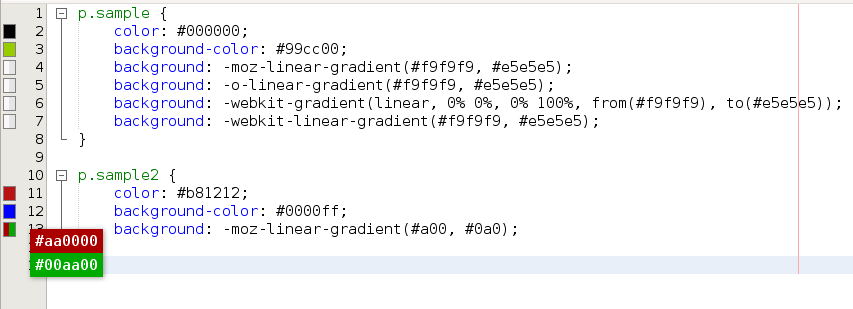
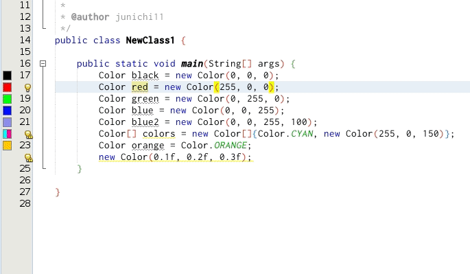

# NetBeans Color Codes Preview Plugin 

This plugin shows a color codes preview in an editor's sidebar.

## Disable/Enable

Uncheck/Check `View > Show Colors`

## Downloads

- https://github.com/junichi11/netbeans-color-codes-preview/releases

## Supported color patterns

- Hex color code (e.g. `#fff` `#000000`)
- Css rgb/rgba values (e.g. `rgb(0, 0, 0)`, `rgb(50%, 0%, 100%)`, `rgba(255,255,255, 0.8)`)
- Css hsl/hsla values (e.g. `hsl(0, 100%, 50%)`, `hsla(120, 100%, 50%, 0.5)`)
- Named colors (e.g. `red`, `blue`)
- Java Color class colors (e.g. `Color.black`, `new Color(100, 100, 100)`, `new Color(0, 0, 255, 255)`)

## Multiple colors

- Show top two colors in a sidebar if there are multiple colors in a line.
- If you want to check all colors, please click a specific rectangle. They will be shown as a list.

## Change a color using a color chooser

- Click a colored rectangle
- Click a color value of a list
- Select a new color in the color chooser
- An old color value will be changed to new one with the same format(Hex and CSS)

### NOTE

If "GTK look and feel" is used, an alpha value is not available. So, in that case, this plugin doesn't show the color chooser for `new Color(r, g, b, a)`.

## Options

Tools > Options > Miscellaneous > Color Codes Preview

### Hex and CSS colors

#### Regex for enabled mime-types

Default value is `^text/(x-)?(css|less|sass|scss)$`.
If you would like to disable/enable some mime-types, please change the default regex.
This pattern is used when the plugin checks a mime-type.

If you would like to enable xml files, please add `|.*xml`. i.e. `^text/(x-)?(css|less|sass|scss|.*xml)$`

#### Resolve Sass and Less Variables

This option is `false` by default. If you would like to resolve Sass and Less variables, please check it.

**NOTE:** The simplest cases only e.g. `$green: #0f0;`

#### Named Colors

This option is `false` by default. If you would like to show named colors, please check it.

### Java Color class colors

#### NOTE

If you would like to show colors of `Color.decode(<hex>)` e.g. `Color.decode("#000000")`, Please add `java` to "Regex for enabled mime-types" of Hex and CSS e.g. (`^text/(x-)?(css|less|sass|scss|java)$`)

## NOTE

- Colors may be shown if they are not color codes. e.g. "#feature" contains `#fea`. This plugin recognizes it as a hex color code.
- If you use the GTK Look and Feel, you cannot change an alpha value in the color chooser.
- Hsl or hsla color values may not be changed correctly when you use the color chooser. (There may be 1% errors.)

## Donation

## License

[Apache License, Version 2.0](https://www.apache.org/licenses/LICENSE-2.0)
